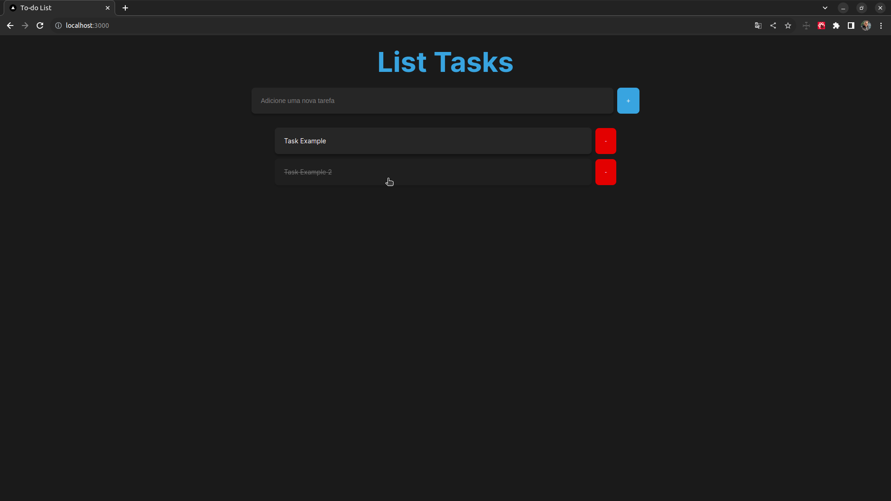

## Sobre

Desenvolvi esse projeto de lista de tarefas para estudar métodos de consumir uma API REST utilizando JSON-SERVER com GET, POST, PUT e DELETE, também utilizei NextJS.

---

## Tecnologias Utilizadas

Esse projeto foi desenvolvido com as seguintes tecnologias:

- [NextJs](https://nextjs.org/docs/getting-started/installation)
- [Typescript](https://www.typescriptlang.org/)
- [Axios](https://axios-http.com/ptbr/docs/intro)
- [Json-server](https://github.com/typicode/json-server)
- [Jotai](https://jotai.org/docs/introduction)

---

## 📝 Pré-requisitos

Para rodar este projeto é necessário ter instalado na sua máquina as seguintes tecnologias:

- É necessário possuir o [Node.js](https://nodejs.org/en/) instalado na máquina.
- Também, é preciso ter um gerenciador de pacotes seja [Yarn](https://yarnpkg.com/) ou [Npm](https://www.npmjs.com/).

## Para rodar o projeto

1. Instale as dependências: `yarn`
2. Startar a aplicação: `yarn dev`
3. Escolher o emulador da sua preferência.
4. Em outro terminal de sua preferência rode a api: `npm run json-server`

## 📷 Resultado

<h1 align="center">
    
</h1>
